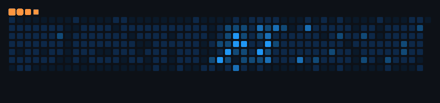

# Aasim Sani

<!-- OPTION A: Capsule Render wave header (replace the # above with this) -->
<!--  -->

<!-- OPTION B: Capsule Render cylinder header -->
<!--  -->

<!-- ═══════════════════════════════════════════════════════ -->
<!-- WIDGET 1: Typing SVG — animated rotating taglines     -->
<!-- ═══════════════════════════════════════════════════════ -->

  

## About Me

- Founding Engineer at [Taxwire](https://taxwire.com) — building a sales tax engine
- Previously co-founded [Orai](https://www.orai.com) (AI speech coach, 1M+ users, Forbes 30 Under 30) and [CopyCat](https://copycat-site.webflow.io/) (Figma → React, 20k+ users)
- Into AI, philosophy, food and making complex things simple
- Ex-professional cyclist, certified mountaineer, semi-pro gamer, occasional musician

<!-- ═══════════════════════════════════════════════════════ -->
<!-- WIDGET 2: Snake animation — eats your contribution    -->
<!-- graph. Requires GitHub Action (see .github/workflows) -->
<!-- ═══════════════════════════════════════════════════════ -->

## Contributions

<picture>
  <source media="(prefers-color-scheme: dark)" srcset="dist/dark-ocean.gif" />
  <source media="(prefers-color-scheme: light)" srcset="dist/ocean.gif" />
  
</picture>

  <!-- SNAKE_DATES:START -->
  Mar 2025 – Mar 2026
  <!-- SNAKE_DATES:END -->

<!-- ═══════════════════════════════════════════════════════ -->
<!-- WIDGET 4: Goodreads — auto-updated reading list       -->
<!-- Requires GitHub Action (see .github/workflows)        -->
<!-- ═══════════════════════════════════════════════════════ -->

## Currently Reading 📚

<!-- GOODREADS:START -->
- [Designing Data-Intensive Applications](https://www.goodreads.com/review/show/7270023403?utm_medium=api&utm_source=rss)
<!-- GOODREADS:END -->

## Recently Read 📖

<!-- GOODREADS_READ:START -->
- [Blood Rites &lpar;The Dresden Files, #6&rpar;](https://www.goodreads.com/review/show/5313127118?utm_medium=api&utm_source=rss)
- [Death Masks &lpar;The Dresden Files, #5&rpar;](https://www.goodreads.com/review/show/5313126903?utm_medium=api&utm_source=rss)
- [Grave Peril &lpar;The Dresden Files, #3&rpar;](https://www.goodreads.com/review/show/5313126806?utm_medium=api&utm_source=rss)
- [Summer Knight &lpar;The Dresden Files, #4&rpar;](https://www.goodreads.com/review/show/5313126972?utm_medium=api&utm_source=rss)
- [Fool Moon &lpar;The Dresden Files, #2&rpar;](https://www.goodreads.com/review/show/5313126610?utm_medium=api&utm_source=rss)
<!-- GOODREADS_READ:END -->

<!-- ═══════════════════════════════════════════════════════ -->
<!-- BONUS: Capsule Render footer wave                     -->
<!-- ═══════════════════════════════════════════════════════ -->

